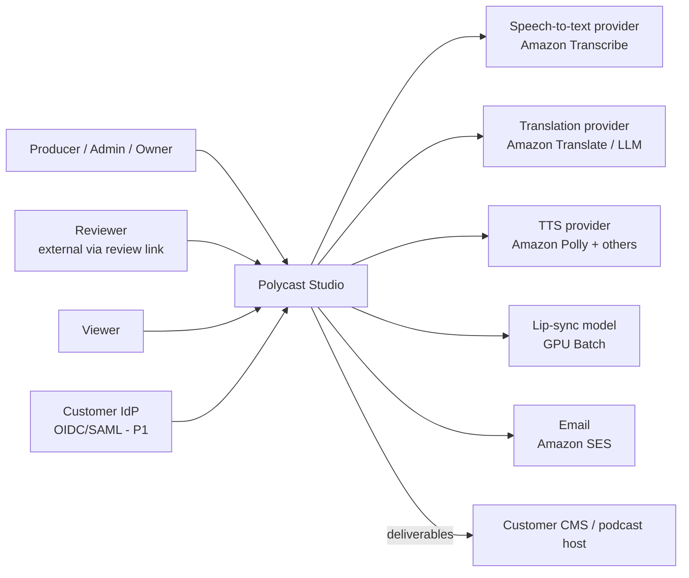
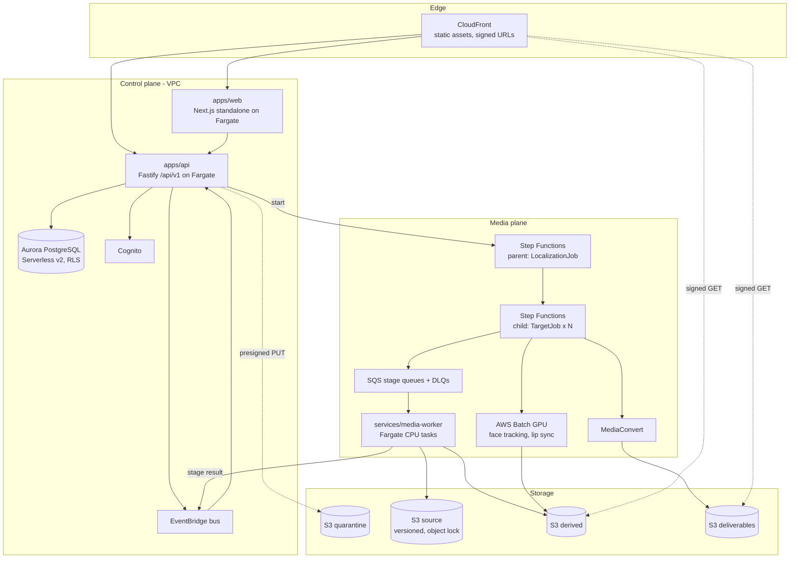
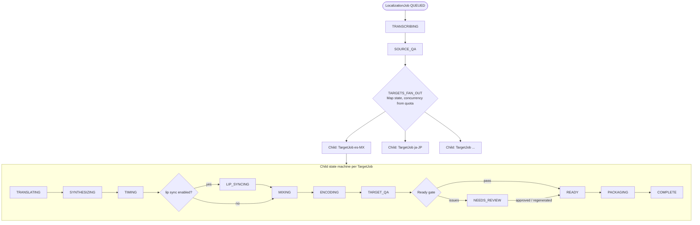
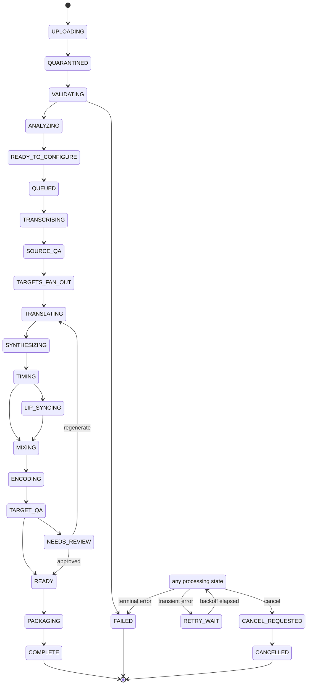
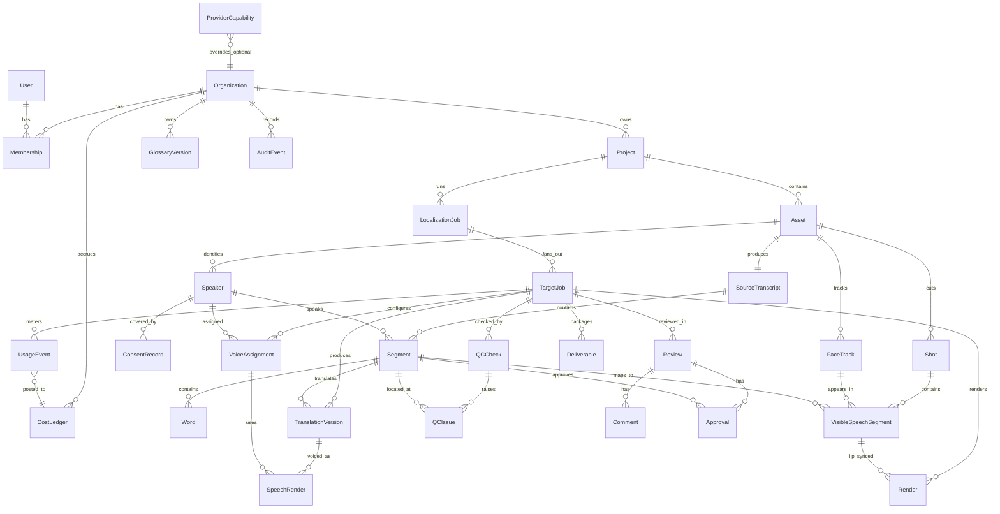

# Architecture

Target-state architecture for Polycast Studio. Where a component does not exist yet, the
traceability table (`traceability.md`) says so; this document describes what M1–M4 build toward.

## 1. C4 context



## 2. C4 container



Control plane = everything a user request touches synchronously: web, API, database, auth,
event bus. It carries the 99.9% availability target. Media plane = asynchronous, retryable,
horizontally scaled work that may fail and be retried without a user noticing anything but delay.
The only calls from the media plane back into the control plane are events on the bus and
stage-result writes through the API's internal endpoint; workers never hold a database connection.

## 3. C4 component (apps/api and packages)

Nodes marked "planned" do not exist on this branch; the others name real files under
`packages/domain/src`, `packages/contracts/src`, `apps/api/src` and
`services/media-worker/polycast_worker`.

```mermaid
flowchart LR
  subgraph api[apps/api]
    routes[Routes\nhealth, capabilities today; OpenAPI at apps/api/openapi.json]
    auth[Auth middleware - planned M1\nJWT → Membership → role via roles.ts]
    svc[Application services - planned M1\nprojects, uploads, jobs, review, deliverables]
    repo[Repositories - planned M1\ntenant-scoped queries]
    sse[SSE hub - planned M1\nPostgres LISTEN/NOTIFY]
    orch[Orchestration port - planned M1/M2\nLocalOrchestrator | StepFunctionsOrchestrator]
    events[Event publisher - planned M1\nlocal | EventBridge]
  end
  subgraph domain[packages/domain]
    ents[entities.ts]
    sm[state-machine/job-state.ts]
    cap[capabilities/registry.ts]
    time[time/media-time.ts]
    errs[errors/domain-error.ts]
    inv[Invalidation graph\nplanned M1]
  end
  subgraph contracts[packages/contracts]
    zod[Zod schemas\nerrors, capabilities, events, media]
    jsonschema[export-schema.ts\n→ schema/*.schema.json]
  end
  subgraph worker[services/media-worker]
    stages[Stage handlers\nplanned M1]
    protos[Provider Protocols - providers/base.py\nTranscriptionProvider, TranslationProvider, SpeechProvider,\nLipSyncProvider, MediaEncodeProvider, QualityProvider]
    mocks[Mock providers\nproviders/mock.py]
    ffprobe[ffprobe.py\nparse_probe_output]
    models[models.py\npydantic, mirrors JSON Schema]
  end

  routes --> auth --> svc --> repo
  svc --> sm
  svc --> cap
  svc --> inv
  svc --> orch
  svc --> events
  events --> sse
  routes --> zod
  zod --> jsonschema --> models
  stages --> protos
  mocks -.implement.-> protos
  stages --> ffprobe
  stages --> models
```

## 4. Orchestration: parent / child Step Functions



- Parent is Standard workflow (durations up to a year cover multi-day review waits). Child is also
  Standard; the NEEDS_REVIEW wait uses a task token callback resolved by the approve endpoint.
- Every task has `Retry` on transient errors with backoff and a `Catch` that moves the TargetJob to
  RETRY_WAIT (retryable) or FAILED (terminal) and emits `target.stage.changed`.
- Cancellation: API sets CANCEL_REQUESTED, calls `StopExecution` on the child, workers check the
  flag at stage boundaries; final state CANCELLED.
- The local orchestrator (`LocalOrchestrator`) implements the same stage table in-process with a
  Postgres-backed queue so M1 exercises identical transitions.

## 5. Key data flows

### 5.1 Upload

1. `POST /uploads` → API creates Asset (UPLOADING), returns uploadId and part size.
2. Client requests presigned part URLs in batches; PUTs to the quarantine bucket.
3. `POST /uploads/{id}/complete` → S3 CompleteMultipartUpload; Asset → QUARANTINED; `upload.completed`.
4. Validation worker: ffprobe, malware scan, size/duration limits → copy to source bucket (immutable, versioned) → Asset VALIDATED; `asset.validated` or `asset.rejected`.

### 5.2 Analyze

1. `asset.validated` triggers the analysis chain (ANALYZING): proxy + waveform, language detection, transcription with diarization, face tracks and shot detection (video only).
2. Results write SourceTranscript, Segment, Word, Speaker, FaceTrack, Shot, VisibleSpeechSegment.
3. `analysis.completed` → project is READY_TO_CONFIGURE; wizard step 2 loads.

### 5.3 Target job

1. Wizard submit → `POST /localization-jobs` with `Idempotency-Key`; API validates capability tiers, consent for replicas, budget headroom; creates LocalizationJob + TargetJobs; `job.created`.
2. Orchestrator runs parent → fan-out → child per target; each stage handler is idempotent on `(targetJobId, stage, attempt)` and writes artefacts under `derived/{orgId}/{targetJobId}/{stage}/`.
3. Every transition emits `target.stage.changed`; SSE hub pushes to subscribed clients of that organization.

### 5.4 Review and regeneration

1. TARGET_QA writes QCCheck/QCIssue rows; Ready gate fails → NEEDS_REVIEW; `target.review.required`.
2. Reviewer opens review studio, selects a segment, chooses regenerate at stage X.
3. API consults the invalidation graph (§6), marks downstream artefacts stale, enqueues a partial child execution for that segment only.
4. New TranslationVersion / SpeechRender / Render rows are created with parent lineage; approvals on unaffected segments persist.
5. When all P0 issues are resolved or approved, the task token is resolved → READY.

### 5.5 Packaging

1. READY → PACKAGING: encoder produces final MP4/MP3, caption files, transcript JSON, QC report, provenance manifest; each hashed.
2. Deliverable rows are created (immutable, versioned); `deliverable.packaged`; notifications.
3. Access is via CloudFront signed URLs (≤ 15 min) minted by the API after role check and audit event.

## 6. Invalidation graph rules

Regeneration at a stage invalidates everything downstream for the affected scope only.

| Regenerate at | Scope | Invalidates | Preserves |
|---|---|---|---|
| Translation (segment) | Segment | SpeechRender, timing, lip-sync Render, mix, encode, QC, approvals for that segment | Other segments, voice assignments |
| Voice assignment (speaker) | All segments of the Speaker in that target | SpeechRender onward for those segments | Translations |
| Timing (segment) | Segment | Lip-sync Render, mix, encode, QC for that segment | Translation, SpeechRender audio |
| Lip sync (segment or shot) | VisibleSpeechSegment | Render, encode, QC | Audio chain |
| Source transcript edit | Segment and every TargetJob | Whole target chain for that segment in all targets | Untouched segments |
| Consent revoked | Speaker across all targets | All SpeechRender/Render using the replica; blocks PACKAGING | Everything not using the replica |

Rules: (1) invalidation is transitive along the stage order; (2) an invalidated artefact is kept
until its replacement succeeds, then deleted per retention; (3) a Deliverable is never mutated,
packaging after regeneration produces a new Deliverable version; (4) approvals attach to the
artefact version they approved, so an invalidated artefact carries its approvals to the grave.

## 7. Event catalog

All events: `{ id: uuidv7, type, occurredAt, organizationId, actor, subject: {type,id}, data }`.
Published on EventBridge (AWS) or the in-process bus (local); persisted in an outbox table for
exactly-once delivery from the API.

| Event | Emitted by | Subject | Consumers |
|---|---|---|---|
| project.created | API | Project | Audit, dashboard |
| upload.completed | API | Asset | Validation worker |
| asset.validated | Validation worker | Asset | Analysis chain, SSE |
| asset.rejected | Validation worker | Asset | SSE, notifications |
| analysis.completed | Orchestrator | Asset | SSE, wizard |
| job.created | API | LocalizationJob | Orchestrator, audit, cost ledger |
| target.stage.changed | Orchestrator / workers | TargetJob | SSE, metrics, cost ledger |
| target.review.required | QC stage | TargetJob | Notifications, SSE |
| target.ready | Ready gate | TargetJob | Packaging, notifications |
| deliverable.packaged | Packaging | Deliverable | Notifications, SSE, audit |
| consent.revoked | API (consent vault) | ConsentRecord | Invalidation, orchestrator, audit |
| audit.recorded | API | AuditEvent | Audit sink (append-only) |

## 8. Job state machine



Transitions are the only way to change a status; `packages/domain/src/state-machine/job-state.ts`
exposes `canTransition(from, to)` and `transition(from, to)`, which throws `IllegalTransitionError`
(property-tested in `packages/domain/test/job-state.test.ts`); the API (once it persists jobs, M1)
never writes `status` directly.

## 9. Entity relationships



Every row carries `organization_id`; Postgres RLS uses `current_setting('app.org_id')`. IDs are
UUIDv7. Times inside media are `bigint` microseconds (`start_us`, `end_us`); wall-clock times are
`timestamptz`.

## 10. Retention and deletion map

| Data | Store | Default retention | On project delete | On org delete | On deletion request |
|---|---|---|---|---|---|
| Quarantine upload | S3 quarantine | 24 h lifecycle | Immediate | Immediate | Immediate |
| Source asset | S3 source (versioned) | Org policy (default 365 d) | Delete all versions | Delete after 30 d hold | Delete within 30 d |
| Proxy, waveform, stems, renders | S3 derived | 90 d after COMPLETE | Immediate | Immediate | Within 30 d |
| Deliverables | S3 deliverables | Org policy | Delete | Delete after hold | Within 30 d |
| Transcripts, translations, words | Aurora | With project | Hard delete | Hard delete | Within 30 d |
| Face / voice embeddings | Aurora (encrypted column) + S3 derived | With asset | Immediate | Immediate | Immediate (priority) |
| ConsentRecord | Aurora | 7 y after revocation | Retained | Retained (legal) | Retained, anonymized subject |
| AuditEvent | Aurora + S3 archive | 7 y | Retained | Retained | Retained |
| UsageEvent / CostLedger | Aurora | 7 y | Retained | Retained | Retained (no content) |
| Provider-side copies | Provider | Zero retention contract | Deletion API call + proof | Same | Same |
| Logs, traces | CloudWatch | 30 d (no content by policy) | n/a | n/a | n/a |
| DB backups | Aurora PITR/snapshots | 35 d | Ages out | Ages out | Ages out (documented) |

## 11. Provider capability matrix (current)

All entries are `planned` or `mock`. Nothing is `production`. Protocol names are those in
`services/media-worker/polycast_worker/providers/base.py`; "not yet defined" means the Protocol
is still to be added there.

| Capability | Adapter interface | Current impl | Planned provider | Milestone |
|---|---|---|---|---|
| Validation / probe | `ffprobe.py` (function, no Protocol) | `parse_probe_output` real; no stage | ffprobe | M1 |
| Language detection | `LanguageDetector` (not yet defined) | none | Transcribe identify-language | M3 |
| Transcription + diarization | `TranscriptionProvider` | mock | Amazon Transcribe | M3 |
| Translation | `TranslationProvider` | mock | Amazon Translate, LLM adapter | M3 |
| TTS | `SpeechProvider` | mock | Amazon Polly, second vendor | M3 |
| Voice replica | `SpeechProvider` (replica flag, not yet defined) | unavailable | TBD, consent-gated | M5 |
| Duration matching | `TimingFitter` (not yet defined) | none | in-house (FFmpeg atempo + retranslate) | M3 |
| Stem separation | `StemSeparator` | unavailable | TBD | post-M5 |
| Remix / loudness | `Mixer` (not yet defined) | none | FFmpeg ebur128 | M3 |
| Face tracking / shots | `FaceTracker`, `ShotDetector` (not yet defined) | none | in-house on GPU Batch | M4 |
| Lip sync | `LipSyncProvider` | mock | TBD vendor/model | M4 |
| Encode | `MediaEncodeProvider` | mock | MediaConvert, FFmpeg | M3 |
| QC checks | `QualityProvider` | mock (no real checks; "flags one segment" fixture is M1) | in-house | M3 |
| Notifications | `Notifier` (not yet defined) | none | SES | M3 |
